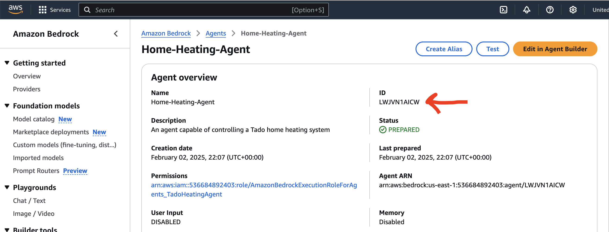

# Tado Heating AWS Bedrock Agent demo

This is a fork of https://github.com/vercel/ai-chatbot, modded (badly) to work with AWS Bedrock and the Tado heating API

Once setup, you can open the chatbot interface on http://localhost:3000 and ask it questions about your heating system or issue commands.

Some of the prompts that work include:
* Get all of the rooms in my house. Create a table with 3 columns: Room Name, Current Temperature, Target Temperature. Create a row for each room, displaying those 3 attributes for each
* Get the current and target temperatures for my bedroom, kitchen and living room, and present them in a bullet list
* Set the temperature in my living room to 15 degrees celsius.
* Knock the temperature up in my bedroom by a couple of degrees more than it currently is please
* Please set my kitchen temperature to 14 degrees celsius, and my living room to 15 degrees celsius
* What’s the current and target temperature for my living room?

## Getting Started
Create a copy of the `.env.example` file and rename it to `.env.local`

### Get your Tado Home ID
Navigate to `https://app.tado.com/` and login with your credentials

Open the developer tools of your chosen browser and go to the network requests.
Look at any of the made API calls and note your Home ID (in this format `https://my.tado.com/api/v2/homes/{YOUR_HOME_ID}/...`)
Add this as your `HOME_ID` in the `.env.local` file

### Deploy your Bedrock Agent in AWS
Use the Terrform files in `./infra` to deploy your own instance of a Tado AWS Bedrock Agent.
```
cd ./infra
terraform deploy
```

Once deployed, go into the Bedrock Agent Console and make a note of the Agent ID:


### Get some temporary creds to use in the chat client
Currently just uses temporary STS creds to communicate with AWS. Definitely not best practice but works for this demo.

Store these credentials within the `.env.local` file

### Build and run the chat client
Install dependencies and run using your favourite node package manager
```bash
npm run dev
# or
yarn dev
# or
pnpm dev
# or
bun dev
```

### Start chatting!
Open [http://localhost:3000](http://localhost:3000) with your browser and start talking to your heating system!
